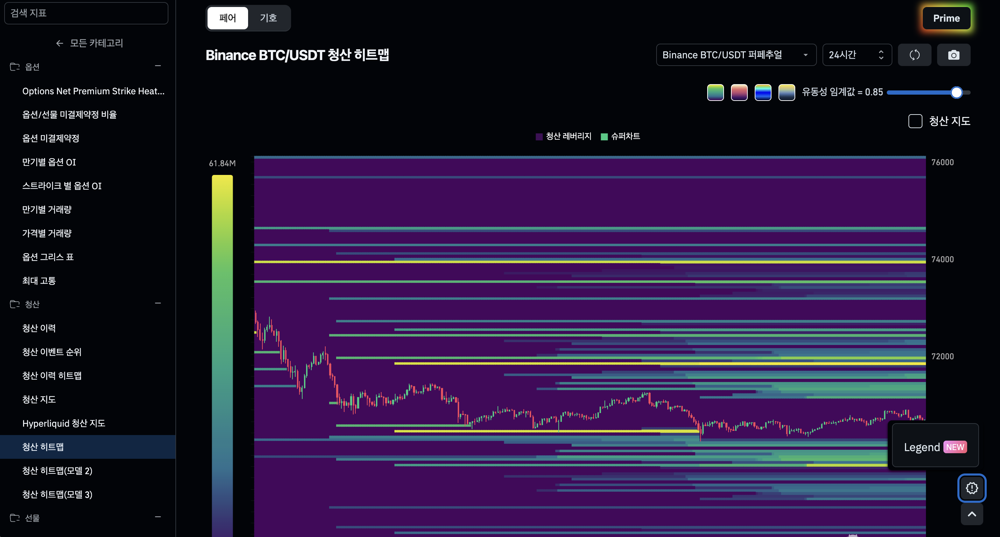
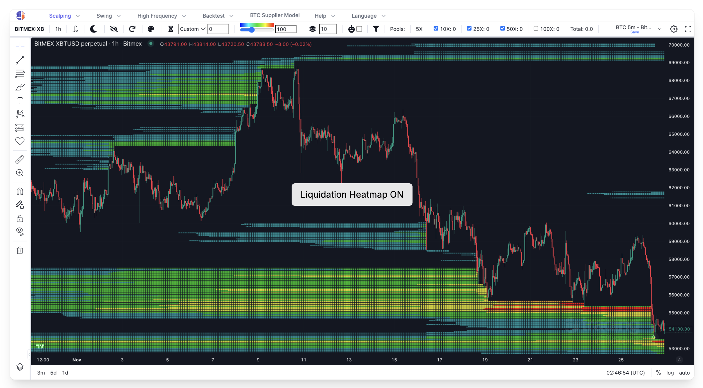
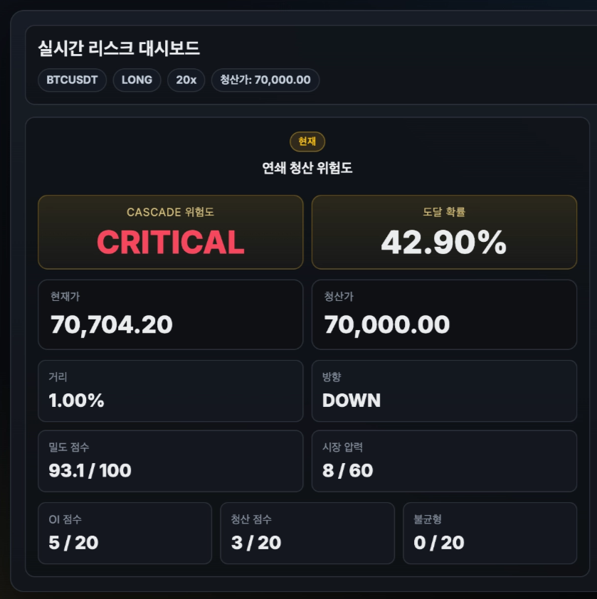
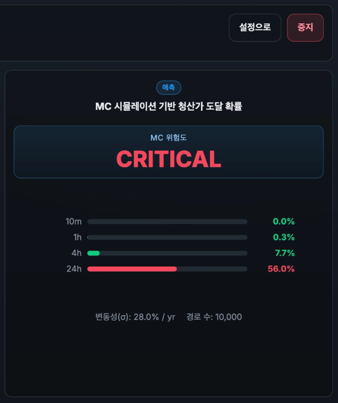
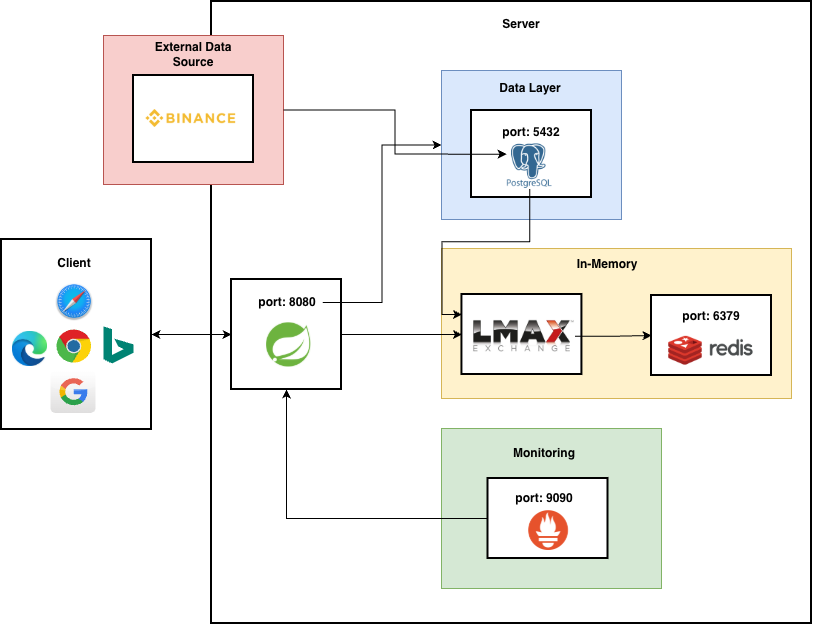
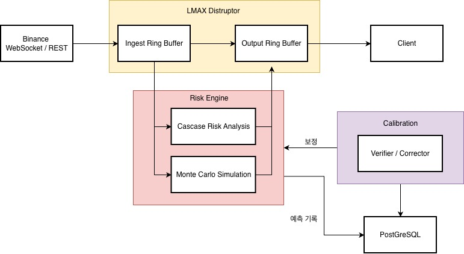

# 서비스 기획

- 현재 국내, 해외 시장에는 청산 위험에 대한 보조 지표(청산히트맵 등)만 제공하고 있으며 이를 해석하여 실제로 청산 확률을 계산해주는 서비스는 아직 없음
- 코인 시장의 차트가 가끔 비정상적인 수직 상승이나 수직 하락을 그리는 이유는 바로 '연쇄 청산' 때문인데, 이에 대한 방어책이 트레이더들에게 필수적임
- 트레이더들이 가장 많이 돈을 잃는 패턴은 청산가가 다가올 때 공포에 질려 감으로 증거금을 더 넣거나, 섣불리 손절하는 것인데 이를 정량적 리스크 관리로 전환할 수 있음

 
 
 

# 프로젝트 내용

- 먼저, 현재가에서 청산가까지의 거리, 현재가 ~ 청산가 사이에 존재하는 물량의 규모와 청산 클러스터(해당 가격에 청산이 될 예정인 물량) 규모를 측정한 후 적절한 가중치를 부여하여 밀도 점수를 계산함
- 다음으로, 미결제약정의 변화량, 최근 실제 청산 횟수, 매도/매수 물량 비대칭을 측정한 후 적절한 가중치를 부여하여 시장 압력을 계산함

 
 
 

- 밀도 점수와 시장 압력을 바탕으로 연쇄 청산 위험도와 도달 확률을 계산하여 스트리밍함

 
 
 

# 기술 스택

| 구분 | 기술 | 버전 |
|------|------|------|
| 언어 / 런타임 | Java | 21 (Docker: Eclipse Temurin 21) |
| 빌드 | Gradle | 8.12.1 |
| 프레임워크 | Spring Boot | 3.4.3 |
| API·실시간 | Spring Web, Spring WebSocket, Spring Validation | Spring Boot 3.4.3 (BOM) |
| 데이터 접근 | Spring Data JPA, Hibernate | Spring Boot 3.4.3 (BOM) |
| 스키마 마이그레이션 | Flyway (+ PostgreSQL 확장) | Spring Boot 3.4.3 (BOM) |
| 운영 DB | PostgreSQL | 16 (`postgres:16-alpine`) |
| 로컬 DB | H2 | Spring Boot 3.4.3 (BOM) |
| 캐시 / 시계열 저장 | Redis | 7 (`redis:7-alpine`) |
| 고성능 이벤트 파이프라인 | LMAX Disruptor | 4.0.0 |
| 외부 HTTP·WebSocket | OkHttp | 4.12.0 |
| JSON | Jackson (databind) | Spring Boot 3.4.3 (BOM) |
| 관측 | Spring Actuator, Micrometer Prometheus | Spring Boot 3.4.3 (BOM) |
| 개발 | Lombok, Spring Configuration Processor | — |

 
 
 

# 아키텍처
### 시스템 아키텍처

 

### 데이터 플로우

 
 
 

# 발생문제 및 해결방법
## 문제1. 실시간 시장 데이터 처리 중 이벤트 처리 지연
- **문제 상황**
    - 바이낸스 WebSocket으로 Mark Price, Order Book, liquidation 이벤트가 동시에 유입될 때, 락 획득 및 반환 과정으로 인한 지연이 존재
    - 이벤트마다 새 객체를 생성/소멸하면서 GC가 자주 발생 → 순간적 지연 발생
- **원인**
    - 일반적인 BlockingQueue 기반 처리 방식은 락 경합으로 고빈도 이벤트 환경에서 처리량 한계 존재
- **해결 방법**
    - LMAX Disruptor의 Lock-free Ring Buffer를 도입하여 이벤트 파이프라인 재설계
    - 링 버퍼 내 오브젝트를 미리 생성해두고 재사용하여 GC 부담을 0으로 만듬
    - Parse → RiskCalculation → Broadcast 단계를 핸들러 체인으로 분리하여 각 단계가 독립적으로 처리되도록 구성
- **결과**
    - 지연 없이 고빈도 이벤트를 안정적으로 처리할 수 있는 구조 확보

 

## 문제2. 수십만 데이터 축적 이후 OOM(Out Of Memory) 및 과도한 랜덤 I/O 발생
- **문제 상황**
    - 데이터가 수십만 건 쌓인 후, 메모리 사용량 급증하여 OOM(Out Of Memory) 발생
    - DB 테이블 본체를 다시 읽으며 과도한 랜덤 I/O가 발생
- **원인**
    - 캘리브레이션 학습 시 `verified = true`인 레코드 전체를 애플리케이션으로 가져와 Java에서 버킷 집계를 수행 → 데이터가 수십만 건 쌓인 후, 메모리 사용량 급증
    - 기존 인덱스 `(symbol, verified)`, `(deadline_epoch_ms, verified)`는 캘리브레이션 학습 쿼리 패턴과 맞지 않았음. `predicted_probability`, `actual_hit` 컬럼이 인덱스에 없어 조건 필터링 후 테이블 본체를 다시 읽는 랜덤 I/O가 발생
- **해결 방법**
    - 커버링 인덱스 `(verified, symbol, horizon_minutes) INCLUDE (predicted_probability, actual_hit)`를 추가
    - 또한 DB에서 `FLOOR(predicted_probability * 10)` 기준으로 버킷 집계 후 최대 10행만 반환하도록 native 쿼리로 교체
- **결과**
    - 인덱스만으로 쿼리를 완결할 수 있어 테이블 랜덤 I/O가 제거됨.
    - 수십만 건 전송 대신 집계 결과 최대 10행만 전송되어 네트워크 전송량과 애플리케이션 메모리 사용량이 대폭 감소